<!-- Based on the original animated terminal layout by AVIVASHISHTA29.
     Portrait is generated from ElitaZ98's supplied image. The graph and stats
     are updated from ElitaZ98's own public GitHub contributions. -->

<h3><code>ElitaZ98@github ~ $ ./contributions.sh</code></h3>

 
 

<h3><code>ElitaZ98@github ~ $ whoami</code></h3>

<table>
<tr>
<td valign="top"></td>
<td valign="top"></td>
</tr>
</table>

 
 

<h3><code>ElitaZ98@github ~ $ ./links.sh</code></h3>

<b>ElitaZ · @ElitaZ98</b>

 

